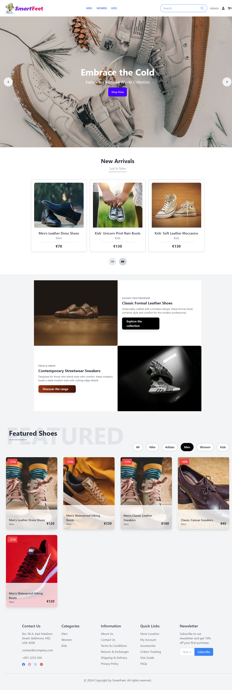
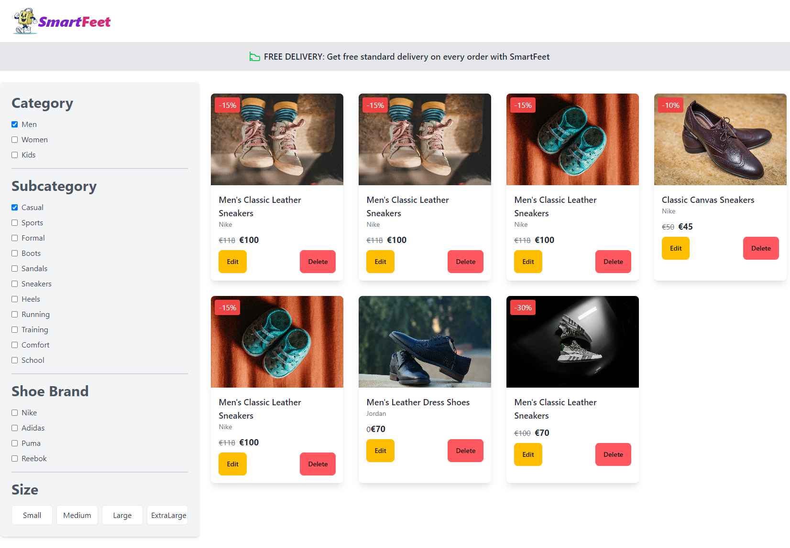
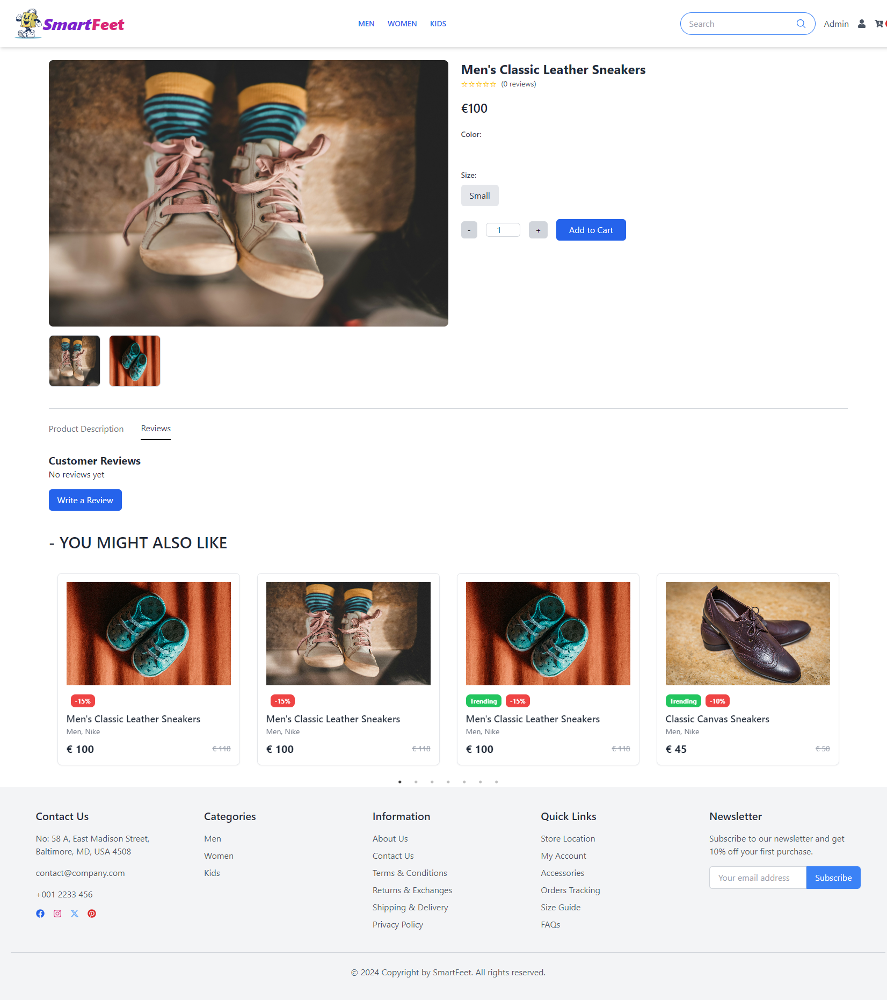
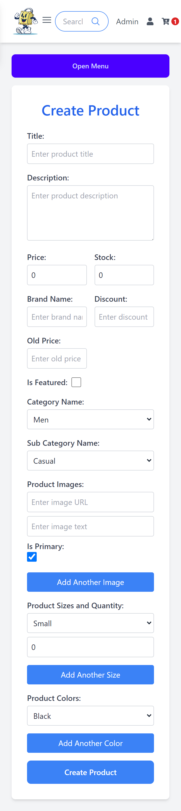
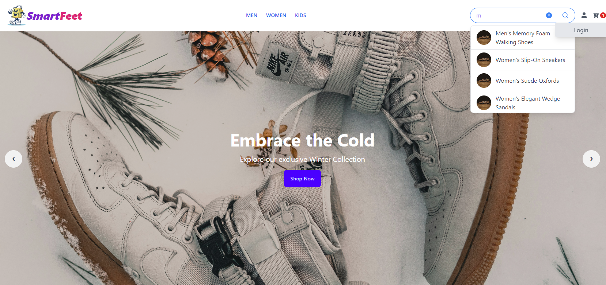

# 🥿 SmartFeet - E-commerce Website for Shoes

This repository contains the **SmartFeet** frontend project, developed as part of [Integrify's Fullstack Developer training program](https://www.integrify.io/program/finland/full-stack). SmartFeet is a modern, user-friendly and feature-rich e-commerce platform where customers can browse, select, and purchase a variety of shoes.

### Live Deployment:

Explore the live deployment of the project by visiting [SmartFeet Shoes](https://smartfeet-ceeb7.web.app/) 🚀

---

## Backend Repository

The backend repository handles all server-side logic, database interactions, and API endpoints necessary to support the SmartFeet platform. Built using **ASP.NET Core**, it follows **Clean Architecture** principles to ensure the application is maintainable and scalable.

You can find the backend repository at the following link: [SmartFeet Backend Repo](https://github.com/sanisaha/fs18_CSharp_FullStack_Backend).

---

## Table of Contents

- [🌟 Features](#features)
- [🛠️ Tech Stack](#tech-stack)
- [📂 Project Structure](#project-structure)
- [🚀 Getting Started](#getting-started)
- [📸 Screenshots](screenshots)
- [🔍 Testing](#testing)

## Features

| Feature                        | Description                                                                                                                                                             |
| ------------------------------ | ----------------------------------------------------------------------------------------------------------------------------------------------------------------------- |
| **Smooth Shopping Experience** | Users can easily navigate through products, view detailed descriptions, and filter or sort items based on various criteria.                                             |
| **User Interactions**          | Customers can create accounts, manage orders, write and update reviews, and add items to their wishlist.                                                                |
| **Admin Functionality**        | Administrators have control over orders, users, products, and other critical aspects of the platform to manage e-commerce operations efficiently.                       |
| **Home Page**                  | Eye-catching carousel showcasing new arrivals, and a featured section for popular products.                                                                             |
| **Product Browsing**           | Advanced filtering by category, subcategory, brand, and size. Detailed product pages with reviews, ratings, and add-to-cart options.                                    |
| **Cart Management**            | View and edit cart items, update quantities directly from the cart, and proceed to checkout or save items for later.                                                    |
| **Authentication**             | Supports Google Sign-in with Firebase Authentication, along with JWT-based secure login for users.                                                                      |
| **Order and Payment**          | Users can place orders via credit card or choose the "Pay Later" option, view and manage their order history.                                                           |
| **User Profile**               | Users can edit details, view order history, and manage reviews.                                                                                                         |
| **Admin Dashboard**            | Admins can create, update, and delete products, as well as manage users and their roles. As admin user can login with email: ["admin@email.com"] password: ["password"] |

---

## Tech Stack

| Category       | Technologies                                |
| -------------- | ------------------------------------------- |
| **Frontend**   | - React                                     |
|                | - TypeScript                                |
|                | - Redux (for state management)              |
|                | - Tailwind CSS                              |
|                | - Daisy UI                                  |
|                | - Firebase (Google Authentication, Hosting) |
|                | - JEST (for unit testing)                   |
| **Backend**    | - C# & .NET Core                            |
|                | - Entity Framework                          |
|                | - PostgreSQL (database)                     |
|                | - XUnit (for unit testing)                  |
| **Deployment** | - Firebase Hosting (Frontend)               |
|                | - Azure (Backend)                           |
|                | - Neon (Database)                           |

---

## Project Structure

App.tsx
src
├── App.tsx
├── app
│ └── data
│ ├── authSlice.ts
│ ├── baseSlice.ts
│ ├── baseUrl.ts
│ ├── cartSlice.ts
│ ├── productSlice.ts
│ └── store.ts
│ └── userSlice.ts
├── assets
│ └── images
├── feature
│ ├── Home
│ │ ├── Carousel.tsx
│ │ ├── CollectionSection.tsx
│ │ ├── FeaturedSection.tsx
│ │ └── NewArrivals.tsx
│ ├── ShoesPage
│ │ └── EditProductModal.tsx
│ ├── SingleProductPage
│ │ ├── RelatedItems.tsx
│ │ └── ReviewModal.tsx
├── firebase
├── layout
│ ├── DashboardLayout.tsx
│ └── Main.tsx
├── models
│ ├── address
│ │ ├── Order.ts
│ ├── category
│ │ ├── Category.ts
│ ├── enums
│ ├── order
│ ├── orderItem
│ ├── other
│ ├── product
│ ├── productColor
│ ├── productImage
│ ├── productSize
│ ├── review
│ ├── shared
│ ├── subCategory
│ └── user
│
├── pages
│ ├── dashboard
│ │ ├── CreateProductPage.tsx
│ │ ├── ManageUserPage.tsx
│ │ ├── Cart.tsx
│ │ ├── Home.tsx
│ │ ├── Login.tsx
│ │ ├── OrderPage.tsx
│ │ ├── ProfilePage.tsx
│ │ ├── Register.tsx
│ │ ├── ShoesPage.tsx
│ │ └── SingleProductPage.tsx
│
├── routes
│ └── PrivateRoute.tsx
│ └── route.tsx
│
├── shared
│ └── services
│ └── Dropdown.tsx
│
├── ui
│ ├── Footer.tsx
│ ├── Header.tsx
│ └── ProductHeader.tsx
└── test

## Getting Started

### Prerequisites

- #### running backend server url

### Installation

1. _Clone the repository_:

   ```sh
   git clone https://github.com/sanisaha/fs18_CSharp_FullStack_Frontend
   ```

2. _Install the dependencies_:

```
npm install
```

3. _Change the api request URL_:

from `app/data/baseUrl.ts`, set baseURL value to backend server value (for example: http://localhost:5096)

```
export const baseURL = your backend server url;
```

4. _start the project_:

```
npm run
```

## Screenshots

### Home Page - New Arrivals & Featured Section



### Product Listing & Filtering



### Product Details with Reviews



### User Profile & Order History


### Admin Dashboard - Manage Products & Users



### User Login - Google and email/password

.png>)

### Header - Search filter



---

## 📝 Acknowledgements

- [React](https://reactjs.org/)
- [TypeScript](https://www.typescriptlang.org/)
- [Tailwind CSS](https://tailwindcss.com/)
- [Daisy UI](https://daisyui.com/)
- [Firebase](https://firebase.google.com/)
